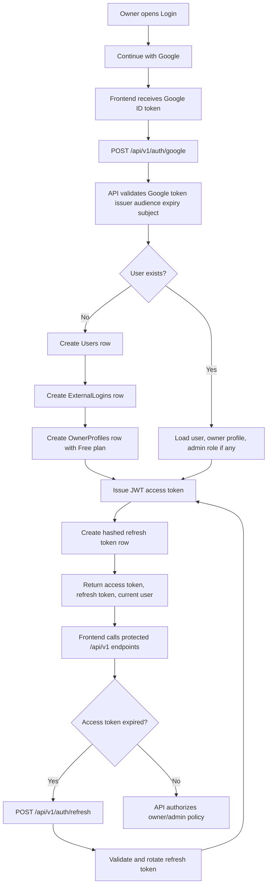
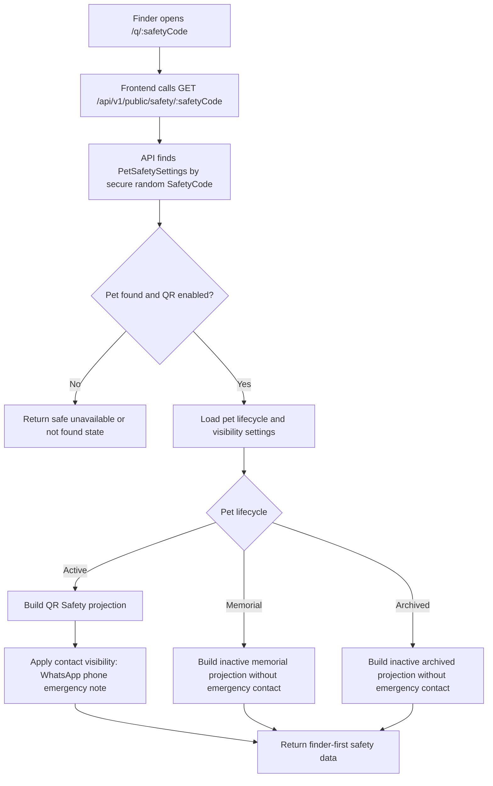
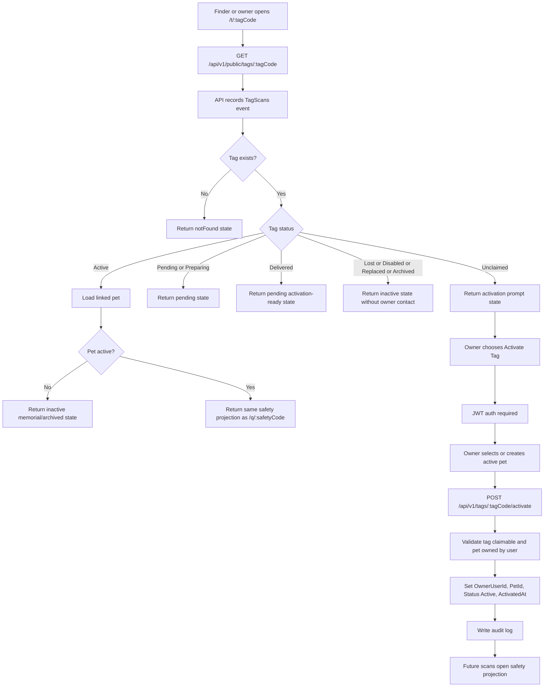
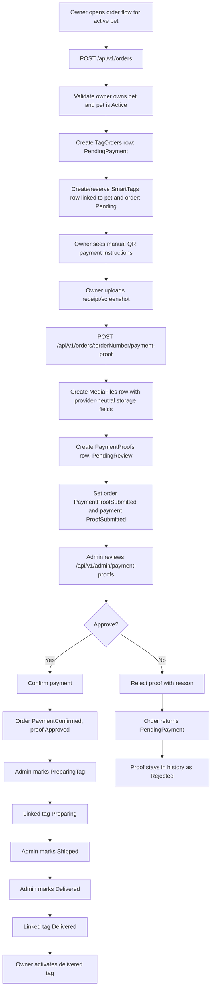
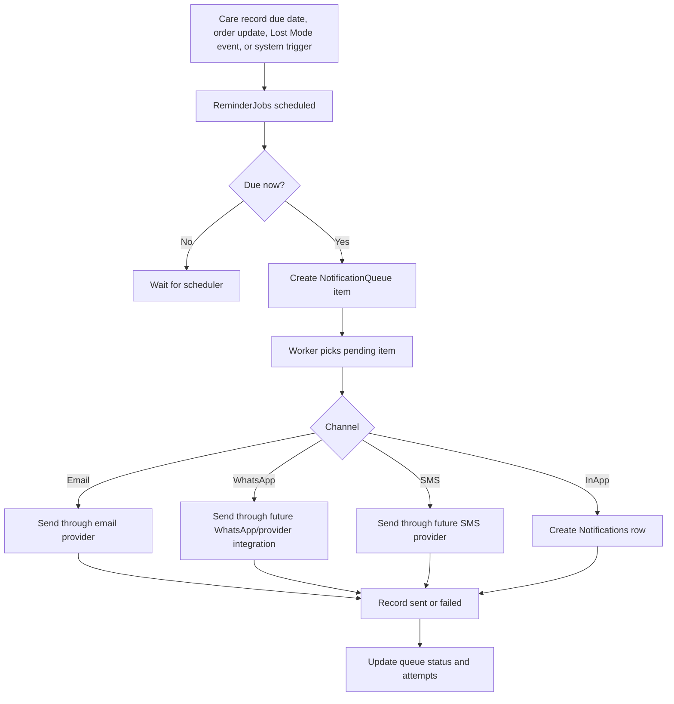
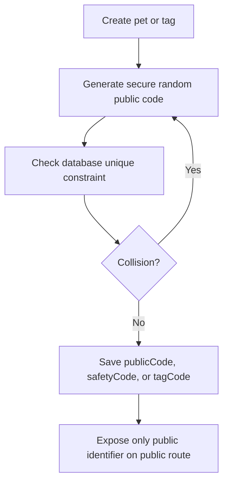
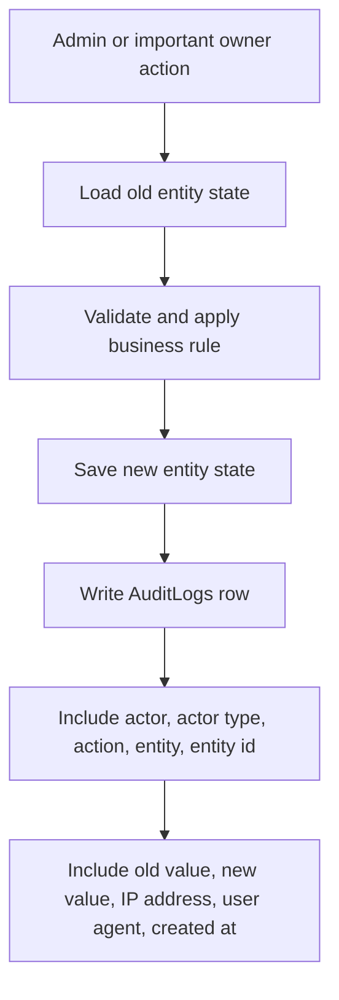

# MyPetLink Backend Architecture

High-level architecture reference for the future MyPetLink backend. This document is planning-only and should guide implementation after the backend project is generated.

API base path: `/api/v1`

## System Shape

```txt
Next.js frontend
  -> /api/v1 REST API (.NET 8)
    -> SQL Server via EF Core
    -> File storage provider interface
    -> Google Sign-In validation
    -> future notification providers
```

Core principles:

- Auth is Phase A, not a later hardening pass.
- All protected APIs are built on JWT access tokens and refresh token rotation.
- Public routes use secure random public codes only.
- Public projections are created server-side and privacy-gated.
- Admin mutations write audit logs.
- Uploaded files use provider-neutral `MediaFiles` records.
- Precise scan location is stored only with explicit finder consent.

## Authentication Flow



Implementation notes:

- Store only refresh token hashes.
- Rotate refresh tokens on every refresh.
- Revoke token family on detected reuse.
- Admin access depends on `AdminUsers`, not only `Users.Role`.

## QR Safety Scan Flow



Implementation notes:

- `/q/:safetyCode` is pet-level and does not require physical tag purchase.
- Physical tag status must not disable `/q/:safetyCode`.
- Memorial and archived pets are not active pets.

## Smart Tag Scan And Activation Flow



Scan analytics location rule:

- Store `Latitude` and `Longitude` only after explicit finder consent.
- If consent is not granted, do not store precise coordinates.
- Without precise consent, only store non-precise IP-based `Country` and `City` when available.
- QR/NFC scan analytics must not be described as GPS tracking.

## Order And Payment Proof Flow



Implementation notes:

- Payment is manual in Phase 1.
- Uploading proof never auto-confirms payment.
- Rejecting proof never deletes the order.
- Portal orders must always have `PetId`.
- Portal-purchased tags are bound to selected pet from the order flow.

## Lost Mode Flow

```mermaid
flowchart TD
    A[Owner opens pet QR Safety management] --> B[Enable Lost Mode]
    B --> C[POST /api/v1/pets/:petId/lost-mode]
    C --> D[Validate owner owns pet]
    D --> E{Pet active?}
    E -- No --> F[Reject: Memorial/Archived pets cannot enable Lost Mode]
    E -- Yes --> G[Save LostModeEnabled and lost details]
    G --> H[Write audit log]
    H --> I[/q/:safetyCode shows missing pet banner and allowed contact]
    I --> J[/p/:slug-publicCode shows Lost Mode exception banner]
    I --> K[Active /t/:tagCode scans show safety page with Lost Mode]
    G --> L[Physical tag statuses unchanged]
```

Implementation notes:

- Lost Mode is a pet-level flag.
- Lost Mode is not Memorial.
- Lost physical tag is not Lost Mode.
- Turning Lost Mode on must not disable active tags.

## Notification Flow Future

Notifications are planned for later phases. The schema should allow them without forcing MVP implementation.



Future notification use cases:

- vaccination reminders
- medication reminders
- grooming reminders
- Lost Mode notifications
- order payment and fulfillment updates

Phase 1 default:

- Keep notification tables and services as planning hooks only.
- Do not build outbound notification provider integration until explicitly scoped.

## Public Identifier Generation



Rules:

- `publicCode`, `safetyCode`, and `tagCode` are secure random public identifiers.
- Use UUID, NanoID, ULID, or an equivalent secure random strategy.
- Do not use incremental ids for public identifiers.
- Do not expose internal database ids on public routes.

## Audit Flow



Rules:

- Required for all admin mutations.
- Recommended for owner tag activation, Lost Mode changes, lifecycle changes, payment proof uploads, and security events.
- Never store secrets, raw tokens, or uploaded file contents in audit JSON.
